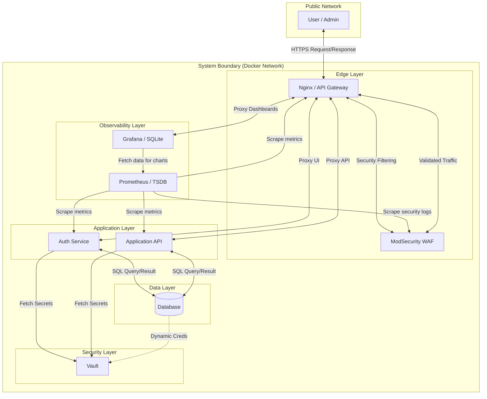

Contents: Frontend, Backend services, Database, WAF, Vault, Network boundaries. This will map 1:1 with Docker Compose later.

# C4 Container Diagram

## Overview

This diagram describes the internal structure of the ft_transcendence platform at the container level. Each container represents an independently deployable or runnable unit.

The architecture follows a minimal microservice approach focused on authentication, access and secure communication.

---

## Containers

### Web Frontend
- Technology: SPA (e.g. React)
- Responsibilities:
  - User interface
  - Authentication requests
- Communicates with backend services via HTTPS

---

### API Gateway / Reverse Proxy (with ModSecurity WAF)
- Technology: Nginx + ModSecurity
- Responsibilities:
  - Single entry point to the platform
  - TLS termination
  - Web Application Firewall (WAF) protection
  - Request filtering and security rules
  - Request routing
  - Basic security controls

---

### Authentication Service
- Technology: Backend service (e.g. NestJS)
- Responsibilities:
  - User registration
  - Login and token issuance
  - Authorization checks

---

### Application API Service
- Technology: Backend service
- Responsibilities:
  - User profile management
- Initially minimal in MVP

---

### Database
- Technology: Relational database
- Responsibilities:
  - User accounts
  - Credentials (hashed)
  - User-related data

---

### Vault
- Technology: HashiCorp Vault
- Responsibilities:
  - Centralized secret management
  - Dynamic credential generation
  - Encryption-as-a-Service

---

### Prometheus
- Technology: Prometheus (TSDB)
- Responsibilities:
  - Self-contained time-series data storage
  - Metric scraping from backend services
  - Alert execution logic

---

### Grafana
- Technology: Grafana
- Responsibilities:
  - Data visualization and dashboards
  - Internal storage for settings/dashboards
  - Administrator interface for monitoring

---

## Communication Flow (MVP)

- Users interact with the Web Frontend or Administrator Dashboards
- All external traffic enters through the Nginx API Gateway (TLS Termination)
- Requests are passed to the ModSecurity WAF engine for deep inspection
- Validated requests are then routed to internal services (Auth, API, Grafana)
- Backend services communicate over an internal network
- Database is not directly accessible from outside the system

---

## Data Persistence & State

We prioritize data integrity and service immutability. The following table explains how each service handles state:

| Service       | Data type                     | Persistence Mechanism |
|---------------|-------------------------------|-----------------------|
| Database      | User profiles, match history  | Docker Volume         |
| Vault         | Encryption keys, credentials  | Docker Volume         |
| Grafana       | Custom dashboards, config     | Docker Volume         |
| Core Services | Application logic             | Stateless             |
| Static Assets | UI components, images         | Immutable Image       |

---

## Deployment Notes

- All containers are orchestrated using Docker Compose
- Services are isolated using container networking
- The platform can be started with a single command via the Makefile

## System Architecture Diagram

## Security and Trust Boundaries

- The API Gateway is the only component exposed to the public network
- All backend services operate within a private container network
- Direct access to backend services and the database is denied
- TLS is enforced between users and the gateway
- Authentication tokens are issued by a dedicated service
- Credentials are stored only as cryptographic hashes
- Service-to-service communication follows least privilege principles
