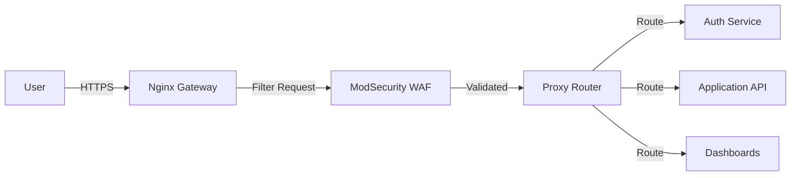

# Nginx Gateway & ModSecurity WAF Guide

This service acts as the **"Guard"** of the ft_transcendence platform. It combines Nginx Reverse Proxy with the ModSecurity Web Application Firewall (WAF) to provide a **first security layer** as part of a **Defense in Depth** strategy.

## 1. Architecture: The First Security Layer
In our design, every external request hits this Gateway first.



## 2. Component: ModSecurity WAF
We use **ModSecurity v3 (libmodsecurity3)**. It is integrated directly into Nginx as a dynamic module.

### How it protects us:
1.  **Request Filtering**: Analyzes incoming HTTP requests (after Nginx decryption) before they reach our backend services.
2.  **OWASP Core Rule Set (CRS)**: We have integrated the industry-standard OWASP rules which detect:
    - SQL Injection (SQLi)
    - Cross-Site Scripting (XSS)
    - Local File Inclusion (LFI)
    - Remote Code Execution (RCE)
3.  **Audit Logs**: All security violations are logged to `/var/log/nginx/modsec_audit.log`.

## 3. Configuration Details

### 3.1 Dockerfile Implementation
The Dockerfile is tailored to:
- Build on **Debian Bookworm**.
- Install `libmodsecurity3` and the Nginx connector.
- Automatically generate self-signed **SSL certificates** for TLS termination.
- Download and configure the **OWASP CRS**.

### 3.2 Nginx Gateway Logic
The `nginx.conf` is configured to act as an **API Gateway**:
- `/auth` -> Proxies to the Authentication Service.
- `/api` -> Proxies to the Application API.
- `/grafana` -> Proxies to the Monitoring Dashboards.

## 4. Developer Workflow
When developing new features, if your request is blocked with a `403 Forbidden`, check the WAF logs:
```bash
docker exec -it gateway tail -f /var/log/nginx/modsec_audit.log
```
This will tell you which security rule was triggered so you can adjust your API design or the WAF rules.

### 4.1 Toggling the WAF during Development
If you need to bypass the WAF temporarily, you can change the behavior in `modsecurity.conf` without rebuilding:
1. Open `services/gateway/conf/modsecurity.conf`.
2. Find `SecRuleEngine On`.
3. Change it to:
   - `SecRuleEngine DetectionOnly`: Logs attacks but **does not block** them (Recommended for debugging).
   - `SecRuleEngine Off`: Disables the engine entirely.
4. Restart the container: `docker restart gateway`.

> [!IMPORTANT]
> The WAF is active (`On`) by default. This ensures that security is not an "afterthought" but a fundamental part of the development cycle.

## 5. Verification & Testing

To verify that the Gateway and WAF are functioning correctly, run these manual tests from your host:

### 1. Test SQL Injection (Blocked)
```bash
curl -I -k "https://localhost/auth?id=' OR 1=1"
```
*Expected: `403 Forbidden`*

### 2. Test Path Traversal (Blocked)
```bash
curl -I -k "https://localhost/api?file=../../etc/passwd"
```
*Expected: `403 Forbidden`*

### 3. Test Valid Request (Allowed)
```bash
curl -I -k "https://localhost/auth"
```
*Expected: `200 OK` (or redirection to login)*

---

## 6. Resources & Credits

- [Web Application Firewall com ModSecurity - Tudo o que o programador precisa saber](https://www.youtube.com/watch?v=uYuqjxHzY-4) (YouTube)
