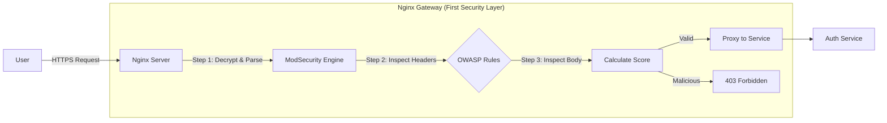

# Cybersecurity: Hardened ModSecurity WAF Guide

This document provides a deep-dive into the **Web Application Firewall (WAF)** implementation for `ft_transcendence`, designed to fulfill the **IV.5 Cybersecurity** requirements. It covers both the high-level architecture and the granular configuration details.

---

## 1. The "Big Picture" Vision: Defense in Depth

In a modern secure architecture, you never trust the internal network. The **Gateway + WAF** acts as the **first security layer** and a hardened "border crossing" for all traffic.

### 1.1 Why this Topology?
By placing the WAF inside the API Gateway:
- **Unified Defense**: One place to manage security rules for all microservices.
- **SSL Termination**: The WAF inspects traffic *after* it is decrypted by Nginx but *before* it reaches the backend.
- **Resource Protection**: Malicious requests are dropped at the edge, saving CPU/Memory on your internal services (Auth, API, etc.).

---

## 2. Logical Flow: The First Security Layer

This diagram visualizes how the WAF evaluates traffic as the first layer in our **Defense in Depth** strategy.



---

## 3. The "Zoom In" Vision: Technical Deep-Dive

### 2.1 The Nginx Connector (`libnginx-mod-http-modsecurity`)
In ModSecurity v3, the engine (`libmodsecurity3`) is separated from the web server. 
- **The Connector** is the bridge. It allows Nginx to "talk" to the ModSecurity engine.
- **Why?** This modular design makes the system faster and more stable. If the WAF engine crashes, Nginx can remain running.

### 2.2 Dockerfile: The Installation Logic
- `libmodsecurity3`: The core logic engine that evaluates rules.
- `libnginx-mod-http-modsecurity`: The dynamic module that hooks into the Nginx request cycle.
- `envsubst`: Used to inject your `${DOMAIN_NAME}` into the configuration at runtime, keeping the image portable.

---

## 3. Configuration Keywords Explained

### 3.1 `modsecurity.conf` (The Engine)
| Keyword | Purpose | Why it's "Hardened" |
|:---|:---|:---|
| `SecRuleEngine On` | Activates the WAF. | Required for active blocking. |
| `SecRequestBodyAccess On` | Inspects POST data (JSON, Forms). | Prevents SQLi hidden in request bodies. |
| `SecAuditEngine RelevantOnly` | Logs only security violations. | Prevents disk filling while keeping forensic data. |
| `SecAuditLogParts ABIJDEFHKZ` | Defines which data parts to log. | Captures headers and bodies for deep analysis. |

### 3.2 `nginx.conf` (The Gateway Integration)
| Keyword | Logic |
|:---|:---|
| `load_module ...` | Tells Nginx to load the WAF "brain" at startup. |
| `modsecurity on;` | Enables the shield for a specific `server` block. |
| `modsecurity_rules_file` | Points Nginx to the combined engine + rules configuration. |
| `client_max_body_size 100M` | Limits request size to prevent Buffer Overflow or DoS attacks. |

---

## 4. Understanding the Rules (OWASP CRS)

We don't just use "any" rules; we use the **OWASP Core Rule Set (CRS)**. These are regular expressions designed to detect attack signatures.

### 4.1 How a Rule works (Zooming in):
A rule looks for patterns like `' OR 1=1`. 
1. **Detection**: ModSecurity finds the pattern.
2. **Scoring**: It adds points to the "Anomaly Score" (e.g., +5 for a SQLi match).
3. **Action**: If total points > 5, the request is blocked.

### 4.2 Why Anomaly Scoring?
Early WAFs blocked on a single match, leading to many "False Positives" (blocking real users). **Scoring** makes the WAF "smarter" and more hardened because it only blocks if multiple suspicious patterns are found in the same request.

---

## 5. Step-by-Step Configuration Guide

This section explains how to replicate the "Integrated Guard" setup from scratch.

### Step 1: Environment & Engine
Install the ModSecurity core and the Nginx connector.
```bash
apt install libmodsecurity3 libnginx-mod-http-modsecurity
```

### Step 2: Configure the WAF Engine
Define how the WAF behaves in `modsecurity.conf`.
1. Enable the engine: `SecRuleEngine On`.
2. Configure Audit Logging to track attacks: `SecAuditLog /var/log/nginx/modsec_audit.log`.

### Step 3: Ingest the Rule Set (OWASP CRS)
Download the rules and include them in your configuration.
```bash
curl -L https://github.com/coreruleset/coreruleset/archive/v3.3.2.tar.gz | tar -xz
```
Include them at the end of your `modsecurity.conf`.

### Step 4: Link to Nginx Gateway
Update `nginx.conf` to load the module and apply rules to your `server` block.
1. Load the module: `load_module /usr/lib/nginx/modules/ngx_http_modsecurity_module.so;`.
2. Activate for the server: `modsecurity on;`.
3. Path to rules: `modsecurity_rules_file /etc/nginx/modsecurity/modsecurity.conf;`.

---

## 6. Pentesting & Verification (Prove it works)

To verify the "hardened" status, perform a small manual pentest.

### 6.1 Test: Simple SQL Injection
Try to access the gateway with a malicious query:
```bash
curl -I "https://localhost/auth?id=' OR 1=1"
```
**Expected Result**: `HTTP/1.1 403 Forbidden`.

### 6.2 Test: Path Traversal
Try to read a system file:
```bash
curl -I "https://localhost/api?file=../../etc/passwd"
```
**Expected Result**: `HTTP/1.1 403 Forbidden`.

### 6.3 Verification: The Logs
Confirm the block in the audit logs:
```bash
tail -f /var/log/nginx/modsec_audit.log
```
You should see the **Rule ID** (e.g., `942100` for SQLi) and the **Anomaly Score** calculation.

---

## 7. Summary
- **Strategy**: Proactive defense-in-depth.
- **Implementation**: Hardened Nginx + ModSecurity v3 + OWASP CRS v3.3.
- **Goal**: Full protection against the "OWASP Top 10" vulnerabilities.

---

## 8. Resources for Further Learning

To deepen the understanding, consult the following official resources:

### ModSecurity & WAF Concepts
- **[ModSecurity Official Wiki](https://github.com/SpiderLabs/ModSecurity/wiki)**: The primary reference for the WAF engine.

### OWASP Core Rule Set (CRS)
- **[OWASP CRS Official Website](https://coreruleset.org/)**: Detailed information on the rules.

### Nginx Integration
- **[Nginx ModSecurity Connector](https://github.com/SpiderLabs/ModSecurity-nginx)**: Connecting Nginx to ModSecurity v3.
