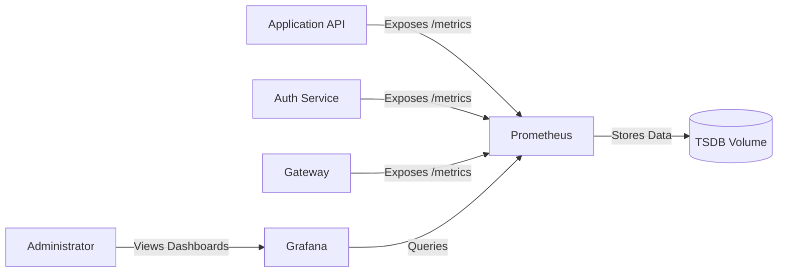

# Walkthrough: Observability & Monitoring (Prometheus & Grafana)

This document details the **Observability & Monitoring Layer** of the `ft_transcendence` platform, providing visibility into system health, performance and security events.

## 1. The "Big Picture" Vision: Observability & Monitoring
In a microservices environment, observing individual components is not enough. We implement a centralized observability stack to correlate events across the entire platform.

### Why this setup?
- **Proactive Health Checks**: Identify failing services before they impact users.
- **Performance Benchmarking**: Track response times and resource usage.
- **Security Monitoring**: Detect anomalies in traffic patterns through the WAF.

---

## 2. Component: Prometheus (The Metrics Store)
Prometheus is our time-series database. It is responsible for gathering metrics from all services.

### How it works:
1.  **Metric Scraping**: Every internal service (Auth, API, Gateway) exposes a `/metrics` endpoint.
2.  **Metric Types**: The application is instrumented to provide different types of data:
    - **Counter**: For values that only increase (e.g., total HTTP requests).
    - **Gauge**: For values that go up and down (e.g., current memory usage).
    - **Histogram**: For distributions (e.g., request duration split into latency buckets).
3.  **Pull Model**: Prometheus "scrapes" these endpoints at regular intervals (default 15s).
4.  **Persistence**: Data is stored in a dedicated Docker volume to survive container restarts.

### 2.1 Technical Zoom-In:
- **Topology**: Prometheus lives on the internal Docker network. It is **not** exposed to the public internet for security.
- **Discovery**: Services are discovered via their **container names** on the common network. For example, Prometheus connects to the API at `http://api:8000/metrics`.

---

## 3. Component: Grafana (The Visualization Hub)
Grafana provides a powerful interface for administrators to visualize the data stored in Prometheus.

### Why Grafana?
- **Unified Dashboards**: Combine metrics from different services into a single view.
- **Role-Based Access**: Restrict access to system metrics to administrative users only.
- **Alerting**: Although MVP scope is visualization, Grafana is ready to be configured for real-time alerts.

### 3.1 Technical Zoom-In:
- **Data Source**: Pre-configured to point to the Prometheus container: `http://prometheus:9090`.
- **Insightful Visualizations**: Dashboards are set up to monitor critical KPIs:
    - **Request Rate**: Total queries per second.
    - **Average Response Time**: Latency tracking.
    - **Resource Usage**: Real-time CPU and Memory consumption.
- **Persistence**: Dashboards and data source configurations are persisted via Docker volumes.

---

## 4. Logical Flow: The Monitoring Cycle

---

## 5. Verification: Is it working?
To ensure the monitoring pipeline is healthy, you can perform these checks:

1.  **Check Discovery**: Access the Prometheus UI at `localhost:9090`, go to **Status -> Targets**. Your services should appear as "UP".
2.  **Query Data**: Use the PromQL editor to execute a simple metric name (e.g., `http_requests_total`). If results appear, it means data is being saved in the database.
3.  **Verify Dashboards**: Access Grafana at `localhost:3000` and confirm that charts are actively updating with the queried data.

---

## 6. Developer Guide: Adding New Metrics
When building a new microservice:
1.  Include a Prometheus client library.
2.  Expose an HTTP endpoint `/metrics` on an internal port.
3.  Add the service to the `prometheus.yml` configuration (or rely on automated discovery if configured).

---

## 7. Summary
- **Strategy**: Infrastructure-as-Code observability.
- **Stack**: Prometheus (Storage/Scraping) + Grafana (Visualization).
- **Hardening**: Observability components are siloed in the internal network and only accessible to verified administrators.

---

## 8. Resources

- [Prometheus & Grafana: Docker Compose Monitoring Tutorial](https://www.youtube.com/watch?v=kAVBNgsrtik) (YouTube): Excellent walkthrough on orchestrating the stack, understanding metric formats (Counter/Gauge/Histogram), and connecting Grafana using internal network names.
